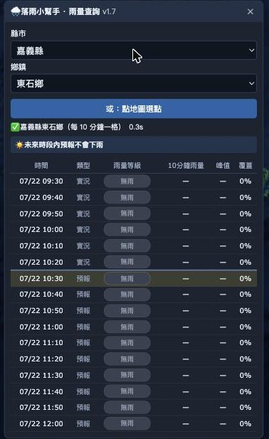

# 🌧️ 落雨小幫手 · 雨量查詢

把 [NCDR 國家災害防救科技中心](https://watch.ncdr.nat.gov.tw/appv2/) 官網的「雨量雲圖 × 時間軸」，轉成使用者所選**鄉鎮**的「**時間 × 雨量等級**」表格，一眼看出何時下雨、雨勢多大。

以 **Bookmarklet（書籤小工具）** 形式交付，注入官網頁面後即可使用，無需安裝外掛。
工具本體不含任何圖資；**村里**功能會在選定鄉鎮時，經 jsDelivr 按需載入約 11 KB 的村里邊界（政府開放資料）。

> ### 🚀 立即安裝
> 開啟 **[線上安裝頁 →](https://abcd1236542000.github.io/watch-ncdr-tool/)**，把頁面上的按鈕**拖曳**到瀏覽器書籤列，即完成安裝。
> 之後到 [NCDR 官網](https://watch.ncdr.nat.gov.tw/appv2/) 點一下該書籤，右上角就會出現查詢面板。
> （詳細步驟見下方[安裝與使用](#安裝與使用)。）

> 本工具不維護版本號，面板與安裝頁顯示的是 build 當天日期。最近變更見 [`CHANGELOG.md`](./CHANGELOG.md)；完整開發脈絡、踩雷紀錄、每輪迭代細節請見 [`docs/record.md`](./docs/record.md)。

---

## 為什麼做這個工具

官網的雨量雲圖是**整片台灣的動態影像**，看的是一大片雲的移動，很難只聚焦在自己關心的小區域（例如自己住的鄉鎮）。

雲圖上色階密密麻麻，肉眼要在一大片色塊裡分辨「我家這裡到底是小雨還是大雨」並不容易，更別說要**對照時間軸**逐格判斷「等一下會不會下雨、雨勢會不會變強」——這件事在雲圖上幾乎無法一眼看出來。

落雨小幫手就是為了解決這個問題：把整片雲圖收斂成**單一鄉鎮、時間序列化**的等級表格，讓「這個地方接下來 16 格（共約 2.5 小時）雨量怎麼變化」變成一眼能讀的資訊，不用自己盯著雲圖動畫猜。

---

## 使用畫面

以下截圖實際操作於官網 `watch.ncdr.nat.gov.tw/appv2/`。

### 1. 注入後開啟面板

工具面板會固定顯示在畫面右側，提供「縣市 → 鄉鎮」下拉選單與「點地圖選點」按鈕。


### 2. 選擇縣市 → 鄉鎮

縣市清單（22 縣市）完全從官網地圖的 SVG 圖層現場取得，不依賴外部資料。


### 3. 查詢結果：時間 × 雨量等級表格

選定鄉鎮後，地圖上以**紅色外框**圈出該鄉鎮，面板同步顯示過去觀測 + 未來預報共 16 格（每格 10 分鐘）的雨量等級。此例（雲林縣麥寮鄉）當下無降雨。


放大看紅框確實精準貼合鄉鎮邊界（非螢幕座標土法煉鋼，而是「經緯度 → GeoJSON 命中」換算而來）：


### 4. 表格隨真實時間自動更新（v1.7 新增）

選定鄉鎮後，表格**不再是選取當下的靜態快照，而會跟著真實時間自動前進**：黃底「現在」列與「實況／預報」分隔線隨時間往下移；跨過每 10 分鐘窗口邊界時，工具會在背景抓取官網新影像、整個時間窗往前滑一格（舊格命中快取，只下載新格，過程不清空表格、不閃爍）。面板按 ✕ 隱藏時暫停更新，重新開啟自動恢復並補上落後進度。



圖中「現在」列正落在「實況／預報」交界（此例嘉義縣東石鄉當下無降雨）；隨著時間經過，這條交界會自動下移、新一格資料自動補入，無需重新選取。表格的上下限也與官網時間軸同步前進。

### 5. 「雷達回波」／「雨量」模式切換，紅框自動重繪

官網左下角按鈕可切換底圖模式，兩者座標系不同（實測縮放比 1.81 倍）。落雨小幫手會偵測模式切換並**自動重新計算紅框位置**，不會跑位。


### 6. 有雨時的完整分級展示

換一個實際下雨的鄉鎮（新竹縣尖石鄉），可看到表格依 17 色階雨量色盤，分出零星/毛雨、小雨、中雨、豪雨等等級色塊，並附上 10 分鐘雨量區間、峰值、覆蓋率（該鄉鎮多邊形範圍內有雨的面積比例）。摘要列會提示「目前正在下雨」與最強時段。


### 7. 點地圖選點

除了下拉選單，也可以按「點地圖選點」直接在地圖上點擊任一位置，工具會換算成經緯度並比對 367 條鄉鎮多邊形，自動命中對應鄉鎮（此例點擊花蓮山區，命中花蓮縣萬榮鄉）。


---

## 功能特色

| 項目 | 說明 |
| --- | --- |
| 雨量呈現 | 級距 + 文字（無雨／零星毛雨／小雨／中雨／大雨／豪雨），非精確數值 |
| 地點輸入 | 縣市→鄉鎮下拉選單，或直接點地圖選點 |
| 取樣範圍 | **整個鄉鎮，或所選村里**。大鄉鎮動輒 300 km²，覆蓋% 會被稀釋——實測屏東縣獅子鄉同一時刻，**楓林村覆蓋 100%（正在下雨）、南世村 0%（沒雨）**，整鄉的數字看不出這件事 |
| 村里圖資 | 內政部「村里界圖」開放資料，切成 368 個鄉鎮小檔（平均 11 KB）經 jsDelivr **按需載入**，不影響書籤大小；載入失敗只會停用村里下拉，整個鄉鎮的查詢照常 |
| 選區視覺回饋 | 所選鄉鎮以紅色外框圈起；選了村里則村里畫紅實線、鄉鎮外框淡化成參考線。模式切換／視窗縮放自動重繪 |
| 面板收合 | 右上角「—」把面板收成小膠囊（膠囊上顯示目前查的地區），**收合期間仍持續更新**，展開就是最新資料；「✕」則完全關閉。標題列可拖曳，位置會保留 |
| 時間範圍 | 過去觀測 3 格 + 未來預報 13 格，每格 10 分鐘（共 16 格） |
| 自動更新 | 選好鄉鎮後表格隨真實時間前進，跨每 10 分鐘邊界自動抓官網新影像、時間窗前滑（v1.7） |
| 查詢速度 | 並行載入 + 快取，約 1 秒（重查同鄉鎮更快） |
| 摘要列 | 「最早降雨時間」與「最強時段」一目了然 |
| 覆蓋率 | 依鄉鎮／村里的實際多邊形遮罩統計，不用方形視窗近似，沿海／小面積鄉鎮也準確；面板會顯示該範圍等效幾個「雷達格」，樣本量透明 |

## 安裝與使用

**線上安裝（推薦，免下載）**

1. 開啟 **[線上安裝頁](https://abcd1236542000.github.io/watch-ncdr-tool/)**
2. 把頁面上的「🌧️ 落雨小幫手雨量查詢」按鈕，用滑鼠**拖曳**到瀏覽器書籤列
3. 到 [watch.ncdr.nat.gov.tw/appv2](https://watch.ncdr.nat.gov.tw/appv2/)，點一下剛加的書籤 → 右上角出現查詢面板
4. 面板選「縣市 → 鄉鎮」，或按「點地圖選點」，即可看該地時間 × 雨量等級表格
5. 想更精準？**選「村里」**——表格就只統計那個村里的範圍。同一個鄉裡，
   一個村在下大雨、另一個村完全沒雨是常態，整鄉的覆蓋% 看不出來。
   按「點地圖選點」也會自動選中你點到的村里

> 面板擋到雲圖？點右上角「**—**」收成小膠囊，膠囊上會顯示目前查的地區，需要時再點「**＋**」展開。

> 看不到書籤列？按 `Ctrl`＋`Shift`＋`B` 開啟。拖不動？安裝頁有「**改用手動新增書籤**」的展開說明，複製書籤網址自行新增即可。

**本機安裝（不透過 GitHub Pages）**

直接用瀏覽器開啟 repo 根目錄的 [`index.html`](./index.html)，其餘步驟同上。

> 工具必須在 NCDR 官網頁面上以 Bookmarklet 形式執行（雷達圖 PNG 無 CORS 標頭，無法做成獨立網頁；原因見 [`docs/record.md`](./docs/record.md) §2.7）。

## 檔案結構

```
watch-ncdr-tool/
├── src/
│   └── rain.js                         可讀原始碼（含註解），開發時只改這支
├── index.html                          安裝頁（根目錄供 GitHub Pages），載入 dist/rain.js 產生書籤與對照表
├── dist/
│   └── rain.js                         terser 壓縮產出，請勿手改（由 npm run build 產生）
├── data/
│   └── vill/1150624/                   村里圖資：index.js + 368 個鄉鎮檔，經 jsDelivr 按需載入
│                                       （由 npm run build:vill 產生，請勿手改）
├── docs/
│   ├── record.md                       持續維護的開發紀錄簿：架構、踩雷紀錄、每輪迭代、待辦
│   └── screenshots/                    本文件使用的操作截圖
├── scripts/
│   ├── build.mjs                       建置：terser 壓縮 + 蓋當天日期建置識別碼
│   └── build-vill.mjs                  村里圖資管線：下載政府開放資料 → 簡化切檔 → 包成 JS
├── .githooks/
│   └── pre-commit                      門禁：src 改了但 dist 沒重編就擋 commit
├── package.json                        build 腳本（terser 由 npx 取得）
├── CHANGELOG.md                        精簡變更清單（日期式，最新在上）
├── LICENSE
└── README.md
```

## 開發流程

> 三條規則：**只改 `src/rain.js`、絕不手改 `dist/`**；**改完 `npm run build`**；**不管版本號，變更記到 `CHANGELOG.md`**。

**前置（每台機器一次性）**：啟用隨 repo 走的 pre-commit 門禁

```bash
git config core.hooksPath .githooks
```

**改程式 → 打包**

修改 `src/rain.js` 後重新打包（terser 由 npx 即時取得免安裝，並自動把當天日期蓋成建置識別碼）：

```bash
npm run build
```

`dist/rain.js` 是建置產物，**請勿手改**——下次 build 會覆蓋。根目錄安裝頁 `index.html` 以 `<script src="dist/rain.js">` 載入它（放根目錄供 GitHub Pages 部署，也可本機直接開啟）。

**記錄變更（取代升版）**

本工具**不維護版本號**：面板與安裝頁顯示的是 build 當天日期（建置識別碼），由 `scripts/build.mjs` 自動蓋，無需人工。改完後在 [`CHANGELOG.md`](./CHANGELOG.md) 最上方加一列（日期＋一句摘要）即可。

pre-commit 門禁只擋一件事：改了 `src/rain.js` 卻忘了 build＋stage `dist/rain.js`。安裝頁的顯示日期、雨量對照表等由 `dist/rain.js` 執行時 (`__RH_MAIN('meta')`) 即時產生，**不需手動同步**。

## 已知限制

- 雨量等級由顏色判讀換算而來，非官方數值，僅供參考
- 等級取取樣範圍內最大值，單一強降雨像素即可拉高整格等級（可搭配「覆蓋率」欄位佐證）
- 縣市／鄉鎮清單依賴官網 SVG 結構，官網若改版需同步調整工具
- **村里功能需要外部託管的圖資**：官網沒有村里圖層，圖資放在本 repo 由 jsDelivr 載入
  （官網 CSP 只放行 jsDelivr／unpkg）。jsDelivr 不可用或官網 CSP 變動時，
  村里下拉會停用，只能查整個鄉鎮
- 升級書籤後請**重新拖曳一次並刪除舊書籤**（書籤內嵌程式碼，舊書籤不會自動更新）。
  若在同一個未重載的頁面先點過舊書籤，舊版殘留的定時器會干擾面板——重新載入頁面即可
- 村里圖資有時效：政府一年更新數次，需重跑 `npm run build:vill` 並更新 `VILL_VER`
- 都市區的小里可能只有數十個雷達格（面積 0.3 km² ≈ 6 格），已接近解析度下限；
  反過來山區的大村仍然很大（獅子鄉內獅村 81.8 km²），**目前沒有比村里更細的切法**
  （曾有「點位半徑圓」功能，因與村里選擇語意重疊而移除，設計仍保留在 `docs/record.md` §12）
- 雷達影像 1 像素約 0.21×0.23 km（≈0.05 km²）：一個村里約數百到一千多格、整個鄉鎮可達數千格。
  面板會顯示格數，數字小時請自行折扣覆蓋% 的可信度

更多細節、每個 bug 的根因與修法，見 [`docs/record.md`](./docs/record.md)。

## 資料來源與授權

- **程式碼**：本專案程式碼（`src/`、`dist/` 內由其產生的檔案）以 [MIT 授權](./LICENSE) 釋出。
- **雨量／雷達影像資料**：版權屬 [NCDR 國家災害防救科技中心](https://watch.ncdr.nat.gov.tw/appv2/)。本工具僅於**執行時**由使用者瀏覽器即時向 NCDR 讀取影像，**未包含、未散布**任何官方資料；本 repo 不含任何 NCDR 圖資。
- **村里邊界圖資**：來源為內政部國土測繪中心「村里界圖(TWD97經緯度)」，取自政府資料開放平台
  [dataset 7438](https://data.gov.tw/dataset/7438)（資料版本 `1150624`），依**政府資料開放授權條款**使用並標示來源。
  `data/vill/` 內的檔案是該開放資料經簡化、切檔後的衍生產物。
- 使用本工具時請遵守 [NCDR 網站的使用規範](https://watch.ncdr.nat.gov.tw/)，並保留資料來源標示。
- 雨量等級為顏色判讀之推估值，**非官方數值，僅供參考**，請以中央氣象署／NCDR 官方發布為準。
