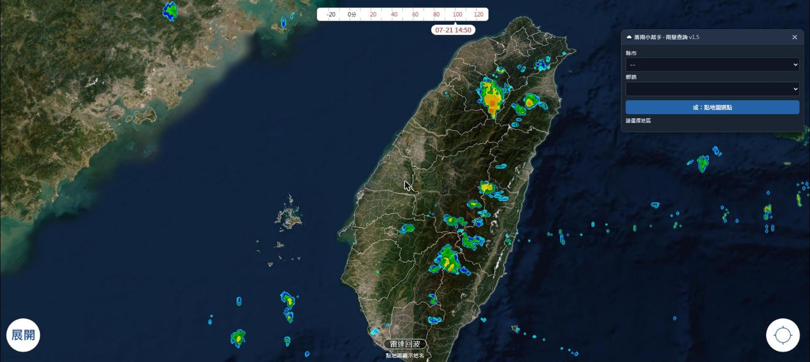
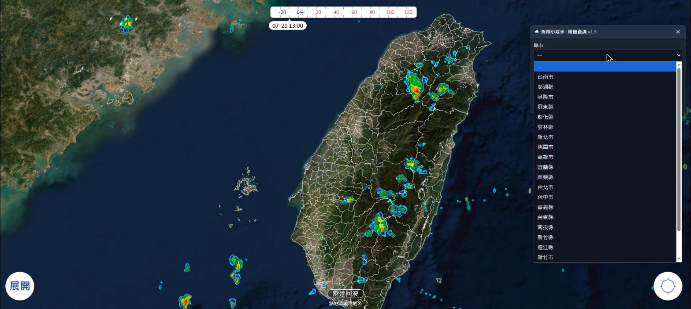
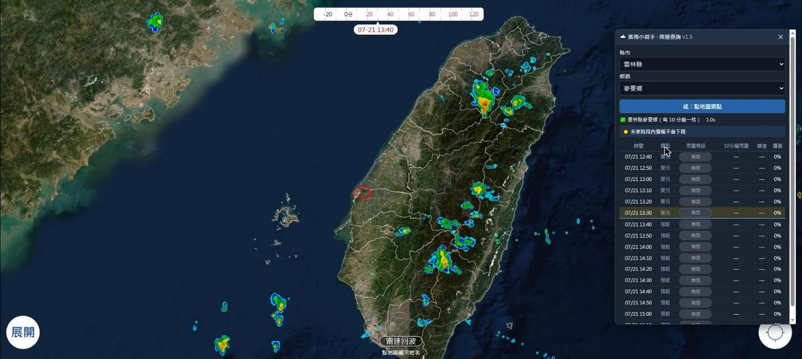
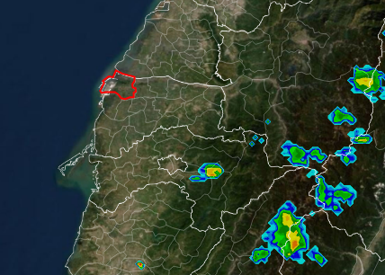
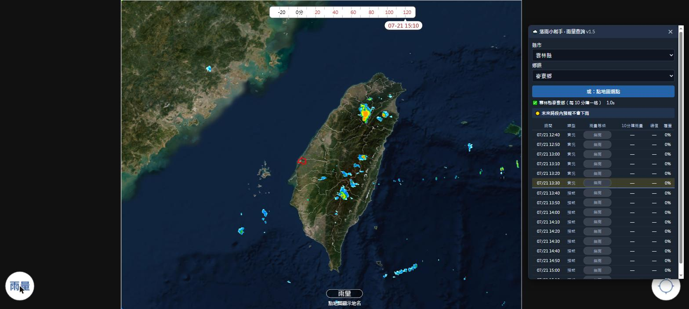
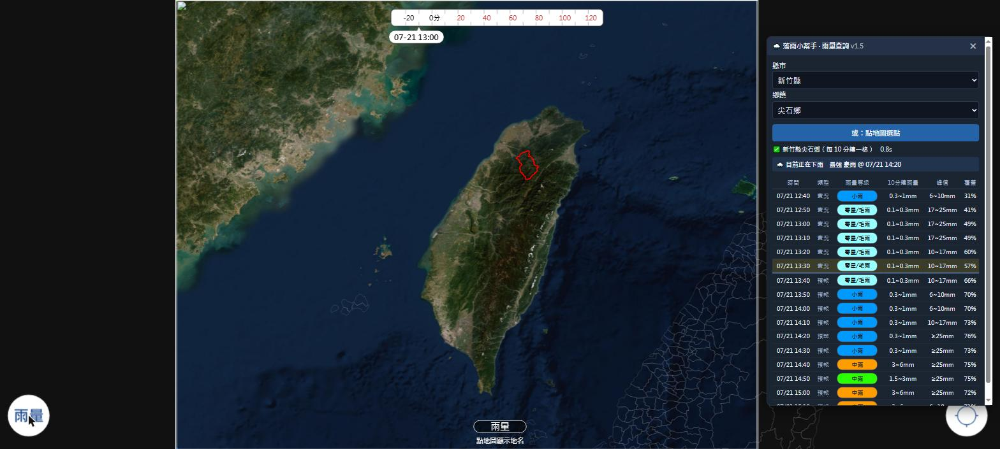
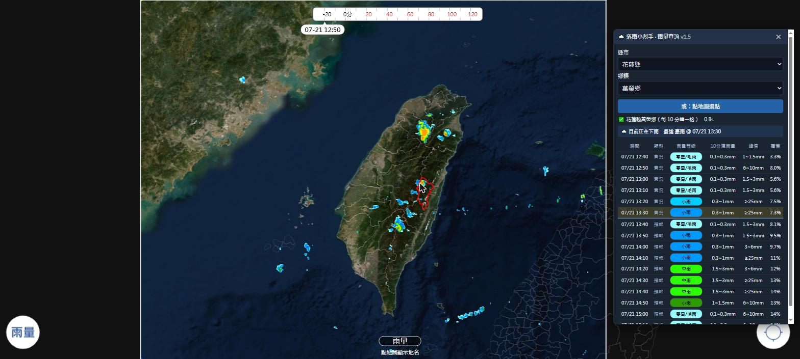

# 🌧️ 落雨小幫手 · 雨量查詢

把 [NCDR 國家災害防救科技中心](https://watch.ncdr.nat.gov.tw/appv2/) 官網的「雨量雲圖 × 時間軸」，轉成使用者所選**鄉鎮**的「**時間 × 雨量等級**」表格，一眼看出何時下雨、雨勢多大。

以 **Bookmarklet（書籤小工具）** 形式交付，注入官網頁面後即可使用，無需安裝外掛、無需外部圖資。

> 目前版本 **v1.6**。完整開發脈絡、踩雷紀錄、每輪迭代細節請見 [`record.md`](./record.md)。

---

## 為什麼做這個工具

官網的雨量雲圖是**整片台灣的動態影像**，看的是一大片雲的移動，很難只聚焦在自己關心的小區域（例如自己住的鄉鎮）。

雲圖上色階密密麻麻，肉眼要在一大片色塊裡分辨「我家這裡到底是小雨還是大雨」並不容易，更別說要**對照時間軸**逐格判斷「等一下會不會下雨、雨勢會不會變強」——這件事在雲圖上幾乎無法一眼看出來。

落雨小幫手就是為了解決這個問題：把整片雲圖收斂成**單一鄉鎮、時間序列化**的等級表格，讓「這個地方接下來 16 格（共約 2.5 小時）雨量怎麼變化」變成一眼能讀的資訊，不用自己盯著雲圖動畫猜。

---

## 使用畫面

以下截圖實際操作於官網 `watch.ncdr.nat.gov.tw/appv2/`。

### 1. 注入後開啟面板

工具面板會固定顯示在畫面右側，提供「縣市 → 鄉鎮」下拉選單與「點地圖選點」按鈕。



### 2. 選擇縣市 → 鄉鎮

縣市清單（22 縣市）完全從官網地圖的 SVG 圖層現場取得，不依賴外部資料。



### 3. 查詢結果：時間 × 雨量等級表格

選定鄉鎮後，地圖上以**紅色外框**圈出該鄉鎮，面板同步顯示過去觀測 + 未來預報共 16 格（每格 10 分鐘）的雨量等級。此例（雲林縣麥寮鄉）當下無降雨。



放大看紅框確實精準貼合鄉鎮邊界（非螢幕座標土法煉鋼，而是「經緯度 → GeoJSON 命中」換算而來）：



### 4. 「雷達回波」／「雨量」模式切換，紅框自動重繪

官網左下角按鈕可切換底圖模式，兩者座標系不同（實測縮放比 1.81 倍）。落雨小幫手會偵測模式切換並**自動重新計算紅框位置**，不會跑位。



### 5. 有雨時的完整分級展示

換一個實際下雨的鄉鎮（新竹縣尖石鄉），可看到表格依 17 色階雨量色盤，分出零星/毛雨、小雨、中雨、豪雨等等級色塊，並附上 10 分鐘雨量區間、峰值、覆蓋率（該鄉鎮多邊形範圍內有雨的面積比例）。摘要列會提示「目前正在下雨」與最強時段。



### 6. 點地圖選點

除了下拉選單，也可以按「點地圖選點」直接在地圖上點擊任一位置，工具會換算成經緯度並比對 367 條鄉鎮多邊形，自動命中對應鄉鎮（此例點擊花蓮山區，命中花蓮縣萬榮鄉）。



---

## 功能特色

| 項目 | 說明 |
| --- | --- |
| 雨量呈現 | 級距 + 文字（無雨／零星毛雨／小雨／中雨／大雨／豪雨），非精確數值 |
| 地點輸入 | 縣市→鄉鎮下拉選單，或直接點地圖選點 |
| 選區視覺回饋 | 所選鄉鎮在地圖上以紅色外框圈起，模式切換／視窗縮放自動重繪 |
| 時間範圍 | 過去觀測 3 格 + 未來預報 13 格，每格 10 分鐘（共 16 格） |
| 查詢速度 | 並行載入 + 快取，約 1 秒（重查同鄉鎮更快） |
| 摘要列 | 「最早降雨時間」與「最強時段」一目了然 |
| 覆蓋率 | 依鄉鎮實際多邊形遮罩統計，不用方形視窗近似，沿海／小面積鄉鎮也準確 |

## 安裝與使用

1. 用瀏覽器開啟 [`落雨小幫手_雨量查詢_安裝說明.html`](./落雨小幫手_雨量查詢_安裝說明.html)
2. 將頁面上的書籤網址拖曳到瀏覽器書籤列
3. 到 [watch.ncdr.nat.gov.tw/appv2](https://watch.ncdr.nat.gov.tw/appv2/) 點一下該書籤即可開啟面板

> 因 NCDR 雷達圖 PNG 沒有 CORS 標頭，工具必須在官網同源環境下以 Bookmarklet 形式執行，無法做成獨立網頁。

## 檔案結構

| 檔案 | 說明 |
| --- | --- |
| `rain.src.js` | 可讀原始碼（含註解），**開發時只改這支** |
| `rain.js` | terser 壓縮後的產出，安裝頁實際載入的檔案；由 `rain.src.js` build 產生，請勿手改 |
| `落雨小幫手_雨量查詢_安裝說明.html` | 安裝頁，內容固定，書籤網址與雨量對照表由 `rain.js` 即時產生 |
| `record.md` | 持續維護的開發紀錄簿：架構細節、踩雷紀錄、每輪迭代變更、待辦 |
| `docs/screenshots/` | 本文件使用的操作截圖 |

修改後重新打包：

```bash
terser rain.src.js -c -m --comments false -o rain.js
```

## 已知限制

- 雨量等級由顏色判讀換算而來，非官方數值，僅供參考
- 等級取鄉鎮內最大值，單一強降雨像素即可拉高整格等級（可搭配「覆蓋率」欄位佐證）
- 縣市／鄉鎮清單依賴官網 SVG 結構，官網若改版需同步調整工具

更多細節、每個 bug 的根因與修法，見 [`record.md`](./record.md)。
